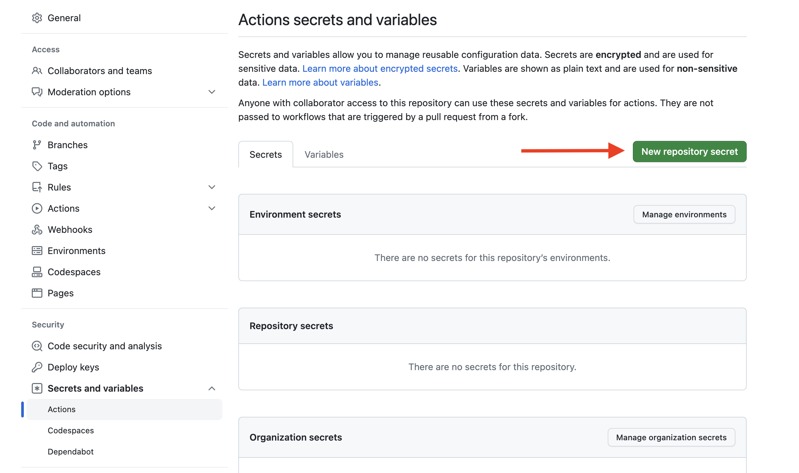
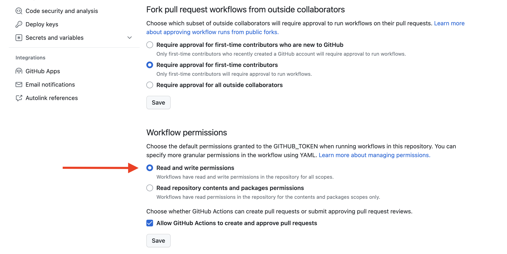

# Terraform Sync Template

Use this template to setup a repo for syncing Polytomic resources into Terraform. The workflow will run on a schedule, and will create a PR with any changes. You can merge the PR to apply the changes.
Under the hood, the workflow uses the [Polytomic Terraform Sync Github Action](https://github.com/marketplace/actions/polytomic-terraform-sync). See the action's [README](https://github.com/polytomic/terraform-export-gh-action) for more details.

## Setup
Create a new repo from this template. Then, add your Polytomic API key as a secret in the repo settings called `POLYTOMIC_API_KEY`.

Secrets can be added by navigating to Settings > Secrets and variables > Actions > New repository secret.

The workflow will run on a schedule and will create a PR with any changes.

## Workflow permissions
For this action to work you must explicitly allow GitHub Actions to create pull requests. This setting can be found in a repository's settings under Settings > Actions > General > Workflow permissions.

For repositories belonging to an organization, this setting can be managed by admins in organization settings under Actions > General > Workflow permissions.

## Customization
You can customize the workflow to run on a different schedule or to push to a specific branch. See the [workflow file](.github/workflows/tf-sync.yml) for more details. Additionally, you can customize the workflow to commit directly to the main branch instead of creating a PR.